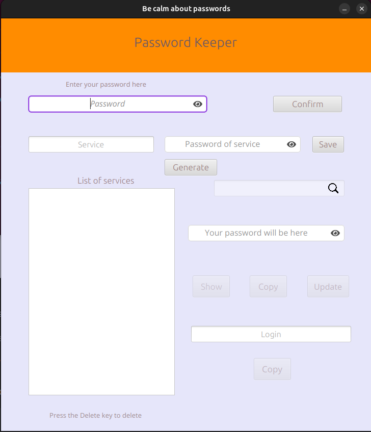

# Password-keeper

##### Program works with 21 version of java or higher

##### Program Description



Think up and insert a password that you will use in the future for encrypting , at least 16 characters.<br>
Then you can save services and passwords in an encrypted way.<br>
File with encrypted data will be stored in 'resources' folder.<br>
You can also generate passwords and use search input.<br>
Further visually everything is more or less clear.

###### To run program do these simple steps:

1. Make sure, that you have java of version 21 or higher.
2. Go to the root folder. (PassKeeper)
3. Run next command for Linux or mac:

```bash
./mvnw javafx:run
``` 

4. For windows:

```bash
./mvnw.cmd javafx:run
``` 

7. To close the program just close the window. 

